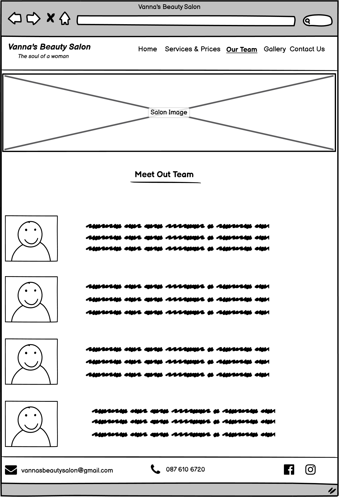

# Vanna's Beuty Salon

Vannas's Beauty Salon is a beauty salon that provides quality and professional services. The focus of this project is to bring their services closer to potential customers.
 Clients can enjoy the family atmosphere and professionalism while relaxing in the time they have decided to give themselves. 

You can view the deployed website here

#
## UX

The site is presented in a minimalist but effective way, providing all the information the user needs. In general, users can find out more about Vanna's Beauty Salon, his team, services and how to contact them, there is also a gallery wher users can find inspiration in nail design or view works before and after appropiate treatments.

## Users Stories 

- As a new user of this website, I want to easily find out the purpose of the site
- As a new user of this website, I want to quickly and easy find the services you provide
- As a new user of this website, I want to quickly and easyily find the price list of your services
- As a new user of this website, I want to see the experience of other client
- As a new user of this website, I want to see pictures of your work
- As a new user of this website, I want to easily found a way to contact you 
- As a new user to this website, I want to meet the team
- As a user, I want to follow the salon on social media so I can keep up to date with the latest information

#
## Scope 

### Features

- An easy and simple navigation throught the website
- List of services and their prices
- Easily visible testimonials of other clients
- A galery with inspiring nail design 
- Contact form so that clients can easily get in touch with the salon
- Easily visible salon contact infromation
- Social links in the footer of each page so user can follow the salon via social networks and be up to date with the latest information

### Future Features

- Online booking so that the client can quickly select the desired date from the calendar 

#
## Structure

- Header  
    - Salon logo positioned left, navigation bar on the right
    - Appears on every page

- Nav bar
    - Appers on every page so users can esily navigate throught the site

- Footer
    - Appears on every page with a contact information and social links

 - Home Page
    - Hero image - appears at the top of the home page, located below the header section, contains striking colors that elevate the look of the page
    - About Us - located below the Hero image, allows users to get more informations about the salon
    - Testimonials - just below the "About Us" section, grouped horizontally, next to each other, for screens smaller than 1200px they are grouped vertically. Allow potential client to see the reviews from current/previous clients, which will help them trust the services offered by the salon
    - Contact Us - provides information about salon opening hours, phone number, email address and a link that leads the user to "Contact Us" page where the user can fill out a form to get in touch with any inquiries they may have
    
-  Services & Prices - allows the user to find out the services and their prices offered by the salon

- Our Team - allows the user to get to know the salon team

- Gallery - allows the the user to see images of the the nail design and perhaps get inspired. Also the "Before and After" section, the user san see the results of the final treatments nails, madotherapy and facial treatments.

#

## Wireframes

### _Home Page_ 

## _Services & Prices_

### _OurTeam_

### _Gallery_

### _Contact Us_

### _Mobile View - Home Page_

### _Mobile View - Our Team_

### _Mobile View - Gallery_

### _Mobile View - Contact Us_

# Surface

## Design 
 As the salon itself exudes calm and relaxation, I created the page in such a tone. The background colors I used are bright and soothing, and the images are bright and colorful. The goal was to bring the user closer to the atmosphere of the salon.

 ### Chosen colors:
- #3a3a3a the main color
- #2a2a2a for all h2 headings and nav bar
- rgba(237, 243, 210, 0.6) - for the "Contact" section 
- rgb(157 157 45 / 43%) - for the "Contact" section for max-width 550px
- rgba(79, 79, 82, 0.6) - for the Footer background
- rgba(154, 175, 185, 0.7) - for the "Price List" background color
- rgba(79, 79, 82) - for the Submit button

### Font 
- Open Sans, sans-serif - main font
- Lato - for all h2 and h3 headings

### Media 
- Hero image - is designed in bright and strong colors to grab the user's attention and elevate the overall look of the page

 - Contact section - contains a background image that is soothing and mild. Not conspicuous, and yet does not make the page monotonous

 - Services & Prices - contains a background imag that is mild and blends nicely with the background color of services and prices

 - Our Team - contains an image just below the navigation . The photo shows a beautician doing a manicure to a customer. I chose this image because it shows a beautician in her work environment and blends nicely with the whole look of the page.

- Gallery - contains nail design images so that the user can find the desired design, if he needs inspiration. The gallery also helps promote the salon

- Contact Us - contains images just below the navigation. Images are placed horizontally. After 950 px they no longer appear on the page.

### Languages 
- [HTML5](https://en.wikipedia.org/wiki/HTML5) 
- [CSS3](https://en.wikipedia.org/wiki/CSS) 

## Technologies Used

- Languages
- Programs

## Testing
- Validating 
- User Story Testing
- Tested Devices
- Browsers
 -Lighthouse

## Bugs and Issues

## Deployment

## Credits