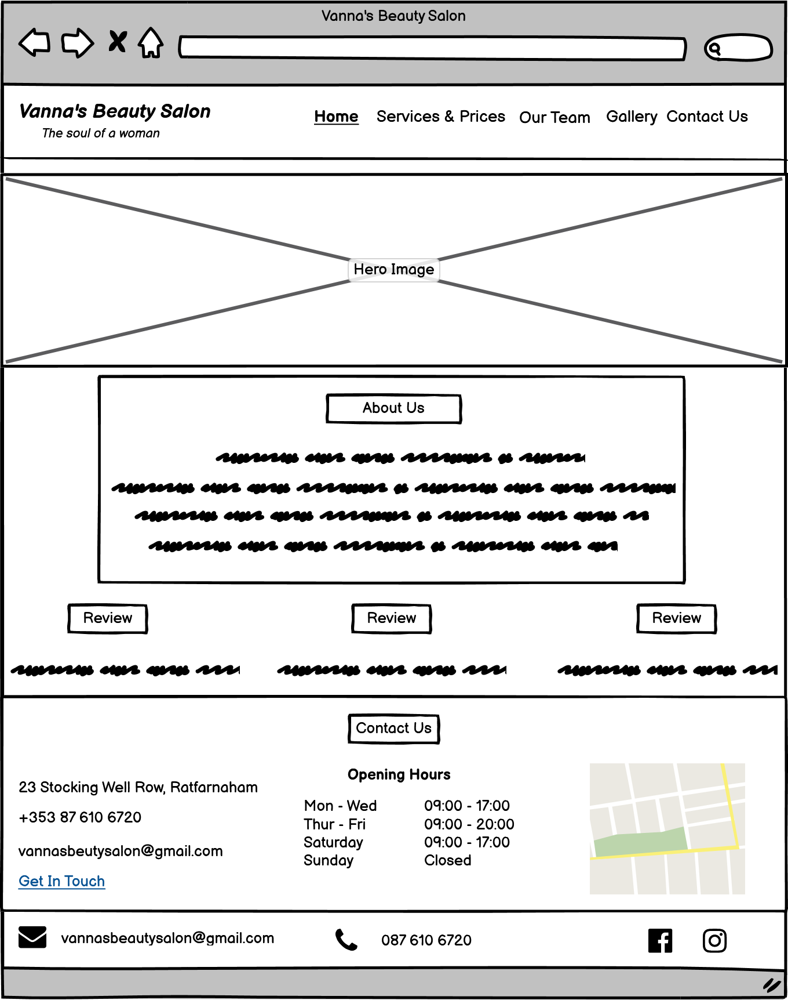
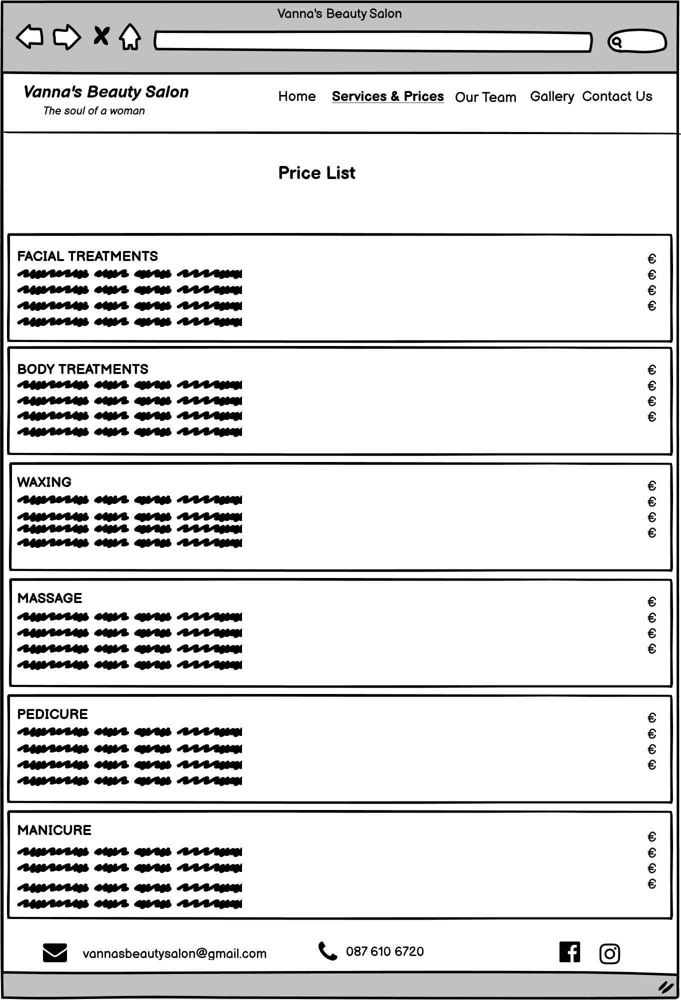

# Vanna's Beuty Salon

Vannas's Beauty Salon is a beauty salon that provides quality and professional services. The focus of this project is to bring their services closer to potential customers.
 Clients can enjoy the family atmosphere and professionalism while relaxing in the time they have decided to give themselves. 

You can view the deployed website here

## UX

The site is presented in a minimalist but effective way, providing all the information the user needs. In general, users can find out more about Vanna's Beauty Salon, his team, services and how to contact them, there is also a gallery wher users can find inspiration in nail design or view works before and after appropiate treatments.

### Users Stories 

- As a new user of this website, I want to easily find out the purpose of the site
- As a new user of this website, I want to quickly and easy find the services you provide
- As a new user of this website, I want to quickly and easyily find the price list of your services
- As a new user of this website, I want to see the experience of other client
- As a new user of this website, I want to see pictures of your work
- As a new user of this website, I want to easily found a way to contact you 
- As a new user to this website, I want to meet the team
- As a user, I want to follow the salon on social media so I can keep up to date with the latest information

## Scope 

## Features

- An easy and simple navigation throught the website
- List of services and their prices
- Easily visible experiences of other clients
- A galery with inspiring nail design and results of final treatments
- Contact form so that clients can easily get i touch with the salon
- Easily visible salon contact infromation
- Socil links in the header and footer of each page so user can follow the salon via social networks and be up to date with the latest information

## Future Features

- Online booking so that the client can quickly select the desired date from the calendar 

## Structure

- Header  
    - Salon logo positioned left, social link right
    - Appears on every page

- Nav bar
    - Appers on every page so users can esily navigate throught the site

- Footer
    - Appears on every page with a contact information and social links
 - Home Page
    - Hero image - shows the interior design of the salon
    - About Us - located below the Hero image, allows users to get more informactions about the salon
    - Testimonials - just below the "About Us" section, grouped horizontally next to each other, allow potential client to see the reviews from current/previous clients, which will help them trust the services offered by the salon
    - Contact Us - provides information about salon opening hours, phone number, email address and a link that leads the user to "Contact Us" page where the user can fill out a form to get in touch with any inquiries they may have
    
- Services & Prices - allows the user to find out the services and their prices offered by the salon

- Our Team - allows the user to get to know the salon team

- Gallery - allows the the user to see images of the the nail design and perhaps get inspired. Also the "Before and After" section, the user san see the results of the final treatments nails, madotherapy and facial treatments.

## Wireframes

### _Home Page_ 

### _Services & Prices_

### _OurTeam_

### _Gallery_

### _Contact Us_

### _Mobile View - Home Page_

### _Mobile View_

## Surface

- Design 
    - Colors 

- Typography
    - Font

- Imagery

## Technologies Used

- Languages
- Programs

## Testing
- Validating 
- User Story Testing
- Tested Devices
- Browsers
 -Lighthouse

## Bugs and Issues

## Deployment

## Credits